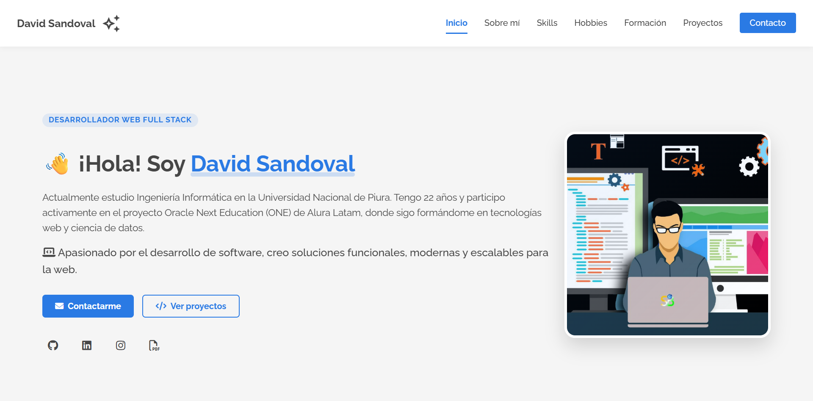
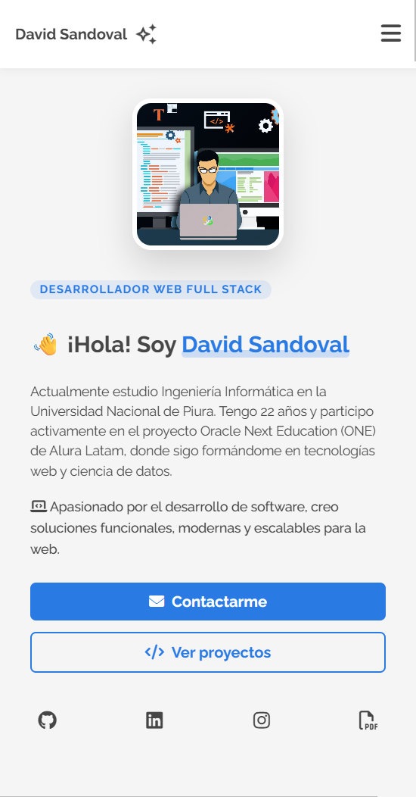
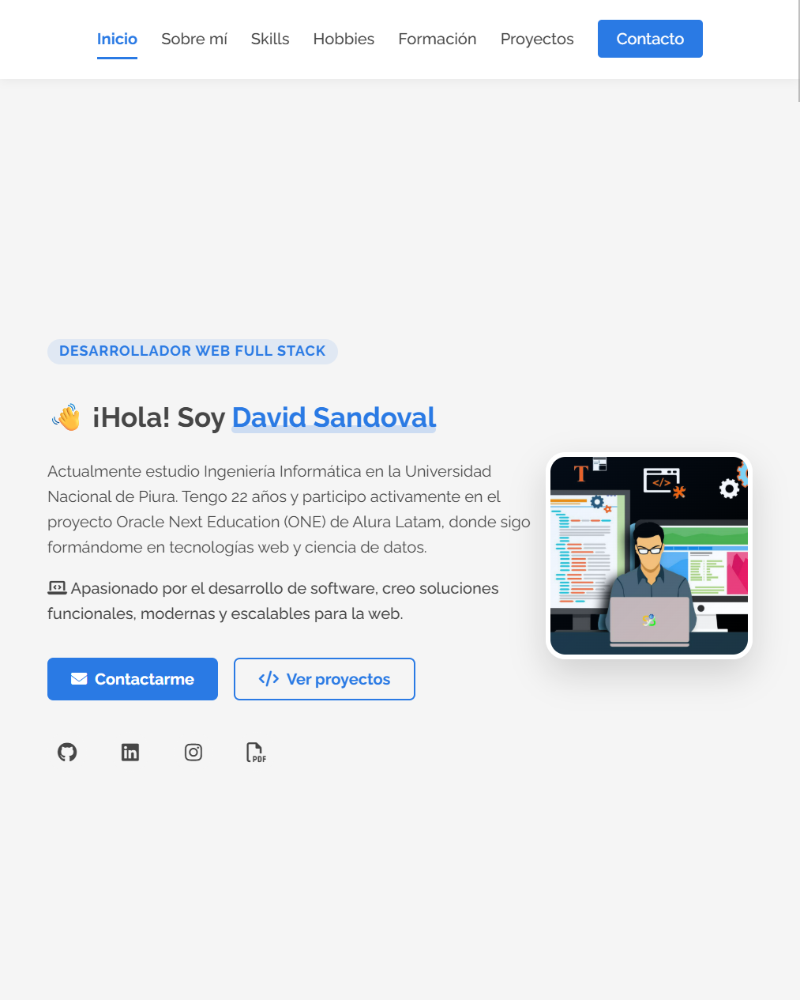

# 💻 Portafolio - Alura Challenge

[](https://github.com/sandovaldavid/portafolio-sprint-01/releases/tag/v2.0.0)

[](https://developer.mozilla.org/es/docs/Web/HTML)
[](https://developer.mozilla.org/es/docs/Web/CSS)
[](https://developer.mozilla.org/es/docs/Web/JavaScript)
[](https://en.wikipedia.org/wiki/Responsive_web_design)
[](https://www.alura.com.br/)

## 📋 Descripción

Portafolio web profesional desarrollado como parte del proyecto Oracle ONE en Alura Latam, que
muestra mi información profesional, habilidades, formación académica y proyectos realizados.
Diseñado con enfoque responsive para adaptarse a cualquier dispositivo y ofrecer una experiencia de
usuario óptima.

## 🌟 Características Principales

-   📱 **Diseño 100% Responsive**: Optimizado para móviles, tablets y desktops
-   🎨 **Interfaz Moderna**: Diseño limpio y profesional con animaciones sutiles
-   🔍 **SEO Optimizado**: Estructura semántica para mejor indexación
-   🔄 **Navegación Intuitiva**: Menú de navegación fijo con scroll suave
-   📝 **Formulario de Contacto**: Sistema de contacto directo con validación
-   🔗 **Enlaces a Proyectos**: Botones para ver demos y repositorios

## 📸 Capturas de Pantalla

<div align="center">
  <h3>💻 Vista Desktop</h3>
  
  
  <h3>📱 Vista Mobile</h3>
  
  
  <h3>📟 Vista Tablet</h3>
  
</div>

## 🛠️ Tecnologías Utilizadas

-   **Frontend:**
    -   
        Estructura semántica
    -   
        Estilizado modular
    -   
        Interactividad
-   **Herramientas:**
    -   
        Control de versiones
    -   
        Editor de código
    -   
        Diseño y prototipado

## 📊 Secciones del Portafolio

1. 🏠 **Header**: Navegación principal con menú responsivo
2. 👋 **Presentación**: Introducción personal con enlaces a redes sociales
3. 👨‍💻 **Sobre Mí**: Descripción profesional y objetivos
4. 🛠️ **Skills**: Habilidades técnicas con iconos ilustrativos
5. 🎮 **Hobbies**: Intereses personales con representación visual
6. 🎓 **Formación Académica**: Educación y certificaciones
7. 📂 **Experiencia Profesional**: Proyectos con capturas y enlaces
8. ✉️ **Contacto**: Formulario para comunicación directa
9. 📝 **Footer**: Información de derechos de autor

## ✨ Características Responsivas

| 📱 Mobile (<600px)      | 📱 Tablet (601px-991px) | 💻 Desktop (>992px)          |
| ----------------------- | ----------------------- | ---------------------------- |
| Menú hamburguesa        | Menú simplificado       | Menú completo                |
| Diseño de columna única | Diseño de 2 columnas    | Diseño de múltiples columnas |
| Imágenes optimizadas    | Imágenes adaptadas      | Imágenes de alta resolución  |

## 🚀 Instalación y Uso

1. Clona el repositorio:

    ```bash
    git clone https://github.com/sandovaldavid/portafolio-sprint-01.git
    ```

2. Abre el archivo index.html en tu navegador preferido.

3. ¡Explora el portafolio!

## 📈 Versiones y Mejoras

Para conocer todas las funcionalidades y mejoras implementadas en cada versión, consulta los
archivos de notas de lanzamiento:

-   [Release v1.0.0](https://github.com/sandovaldavid/portafolio-sprint-01/releases/tag/v1.0.0) -
    Lanzamiento inicial
-   [Release v2.0.0](https://github.com/sandovaldavid/portafolio-sprint-01/releases/tag/v2.0.0) -
    Mejoras de navegación y responsive

## 📝 Licencia

Este proyecto está bajo la Licencia MIT - consulta el archivo [LICENSE](LICENSE) para más detalles.

## 👨‍💻 Autor

### [David Sandoval](https://github.com/sandovaldavid)

-   🌐 Portafolio: [devsandoval.me](https://devsandoval.me)
-   💼 LinkedIn: [@devsandoval](https://linkedin.com/in/devsandoval)
-   💻 GitHub: [@sandovaldavid](https://github.com/sandovaldavid)
-   📧 Email: [contact@devsandoval.me](mailto:contact@devsandoval.me)

---

> **Nota**: Este proyecto fue creado con fines educativos y de entretenimiento. Siéntete libre de
> utilizarlo y modificarlo según tus necesidades.

<div align="center">
  <p>⭐ Si te gustó este proyecto, ¡no dudes en darle una estrella! ⭐</p>
  <p>Desarrollado por <a href="https://devsandoval.me/">David Sandoval</a></p>
  <p>© 2025. Todos los derechos reservados.</p>
</div>
